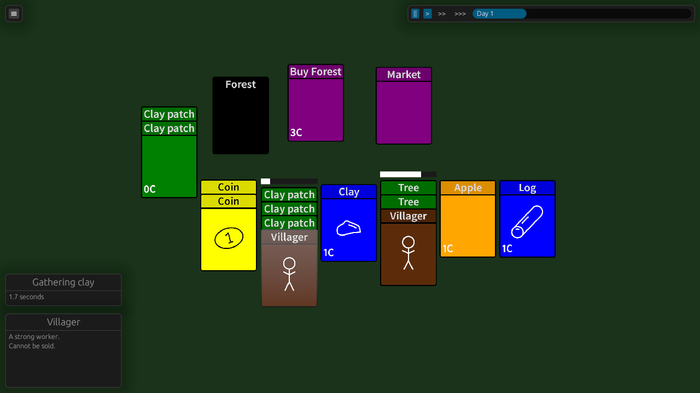

A proof-of-concept in the bevy game engine, inspired by [Stacklands](https://store.steampowered.com/app/1948280/Stacklands/)

To build, use [cargo-make](https://github.com/sagiegurari/cargo-make) (`cargo make`)

# Dependencies
- `cargo-make` for building
- `inkscape` for converting the `.svg` assets into `.png` images.